# Flow Diagrams: NIP-XX (Prepared Migration) & NIP-XY (Social Transition)

---

## 1. NIP-XX: Prepared Migration — Happy Path

The simplest scenario: user enrolls, time passes, migration is needed.

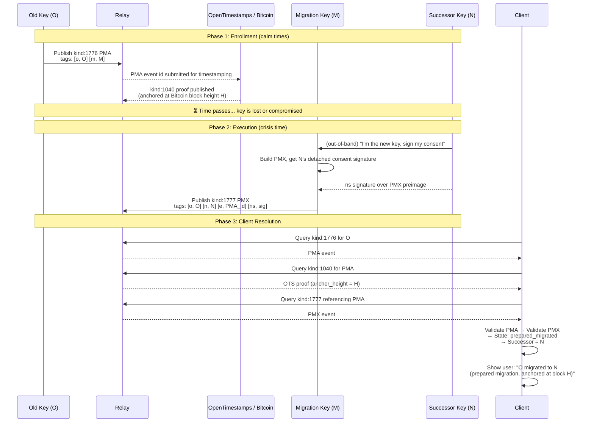

---

## 2. NIP-XX: Authority Update Chain

User rotates the migration key before needing to execute.

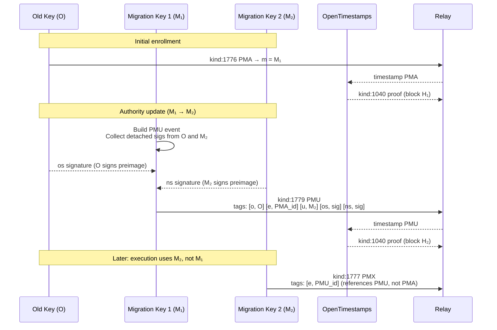

---

## 3. NIP-XX: Authority Resolution State Machine

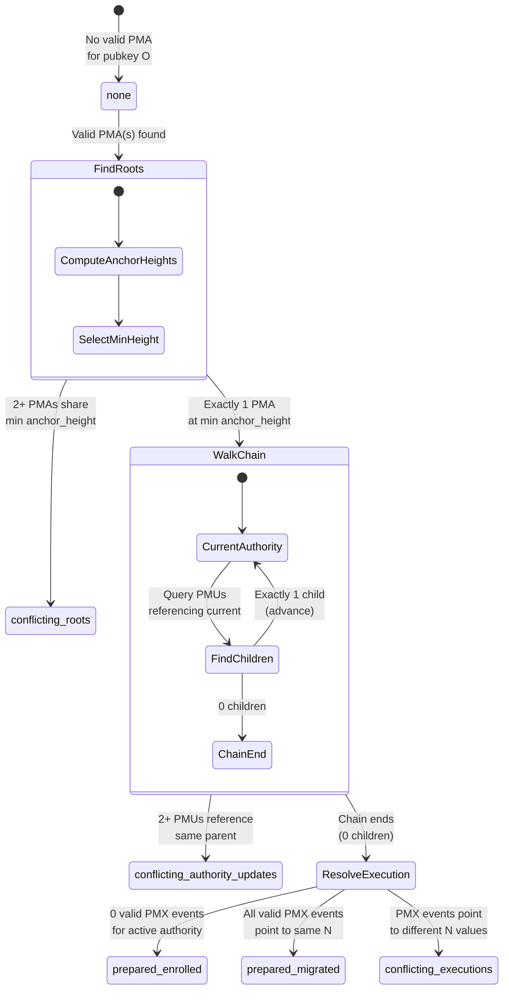

---

## 4. NIP-XX: All Terminal States

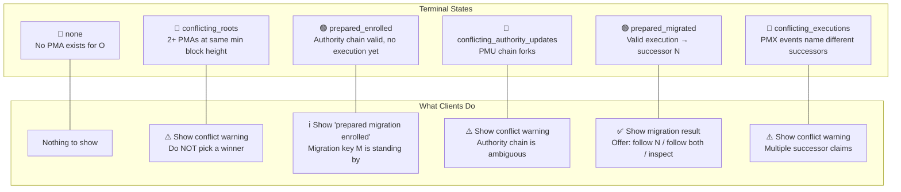

---

## 5. NIP-XY: Social Transition — Claim & Attestation Flow

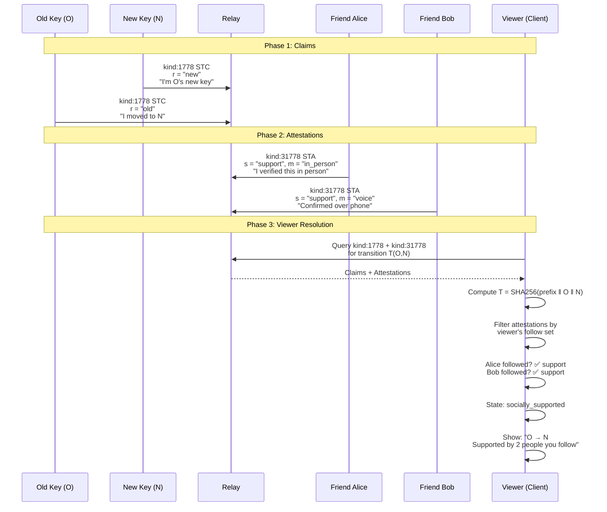

---

## 6. NIP-XY: Social State Resolution (Viewer-Relative)

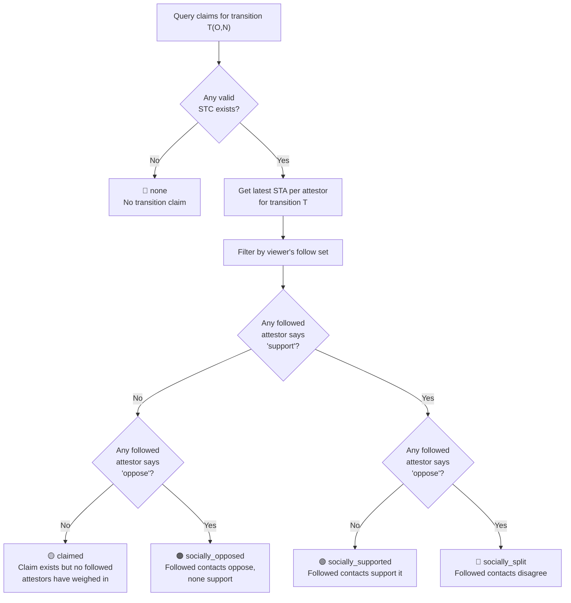

---

## 7. NIP-XY: Attestation Lifecycle (Mutable Stance)

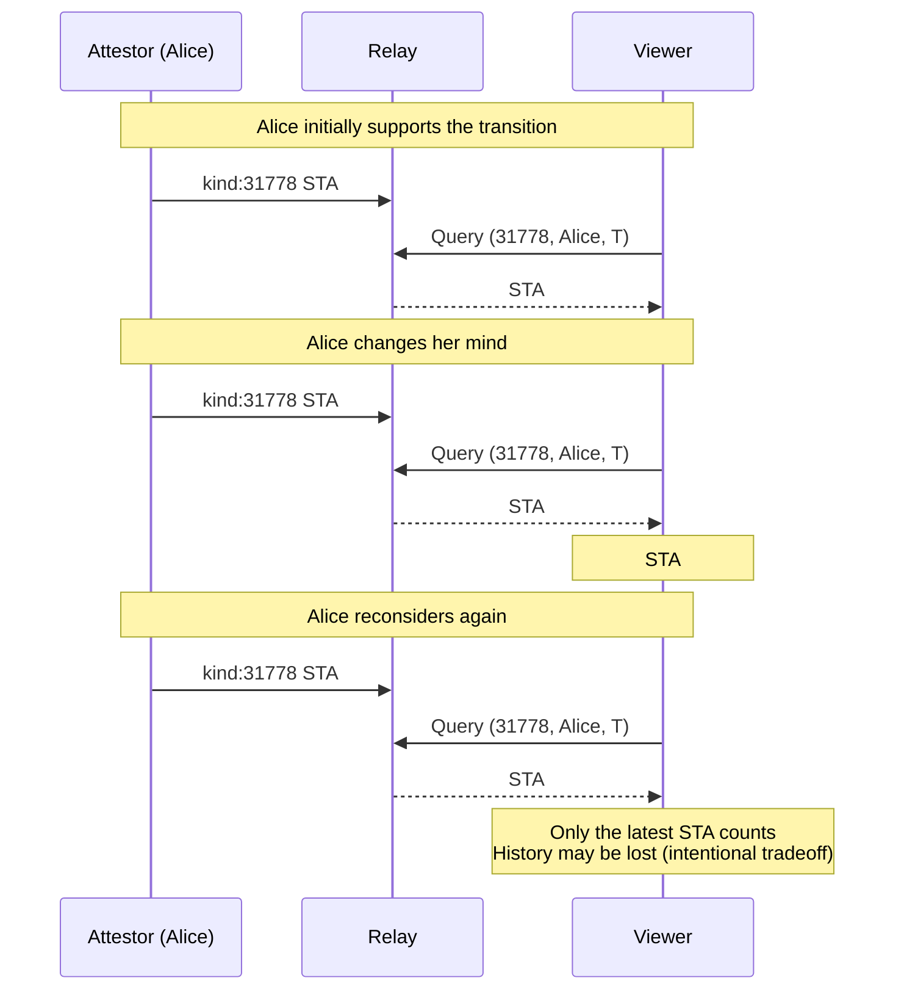

---

## 8. Combined View: Both NIPs Together

How a client composes results from both protocols side by side.

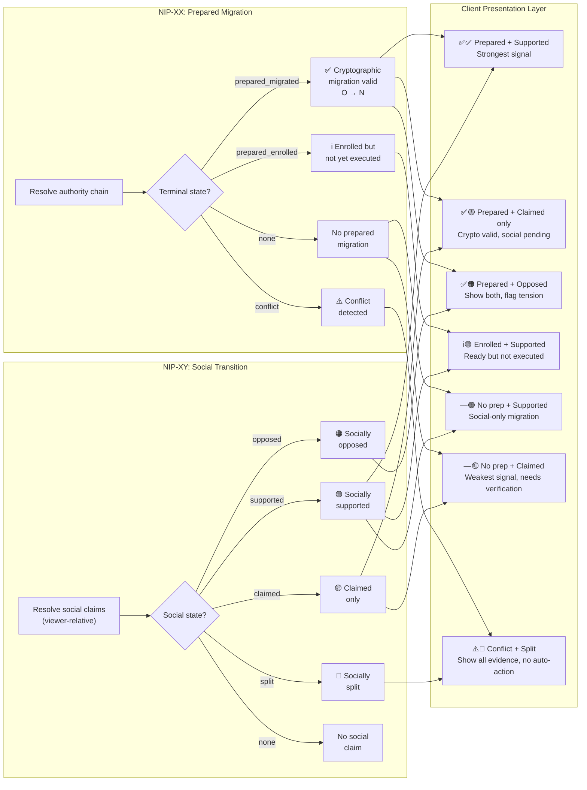

---

## 9. Scenario: Unprepared User (Social-Only Migration)

User lost their key but never enrolled in Prepared Migration.

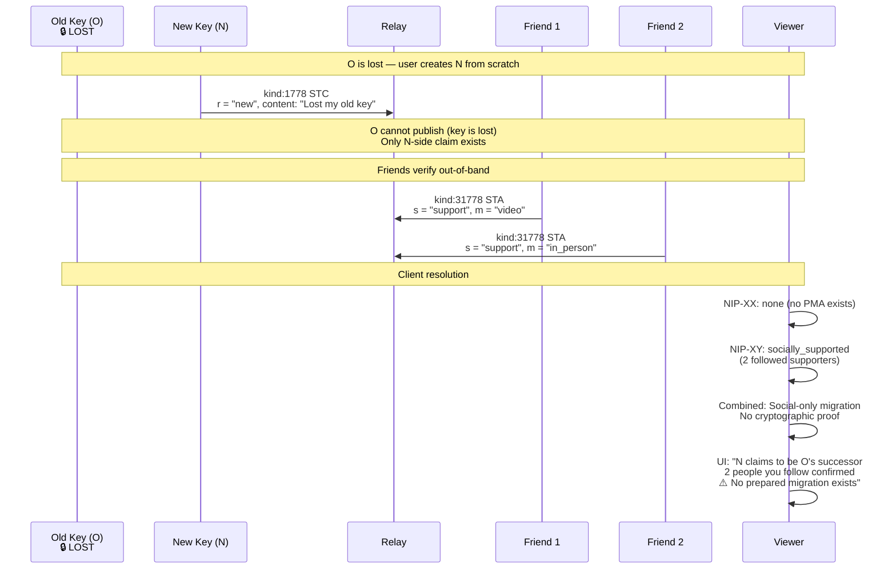

---

## 10. Scenario: Key Compromise Race

Attacker compromises O and tries to create a fake migration, but user had enrolled PMA.

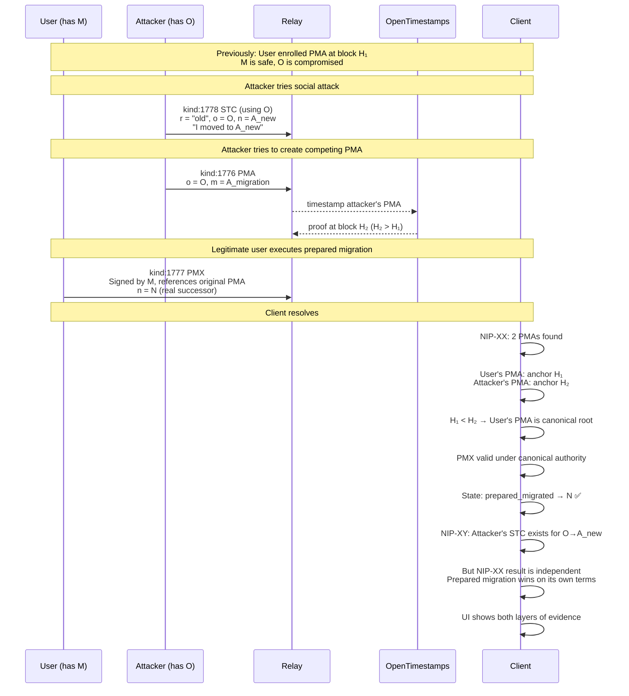

---

## 11. Scenario: Disputed Transition (Social Split)

Community disagrees about a transition's legitimacy.

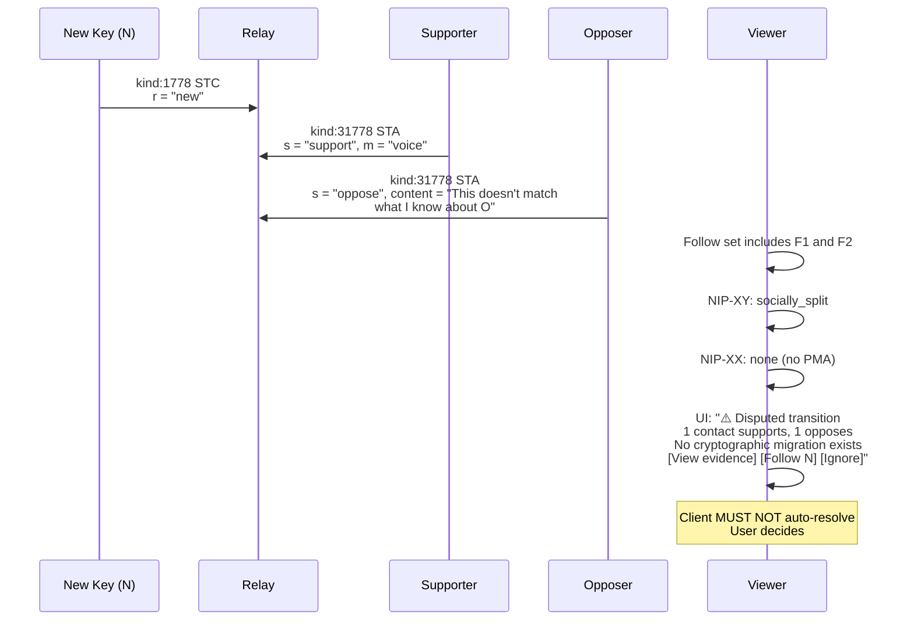

---

## 12. Event Kind Reference

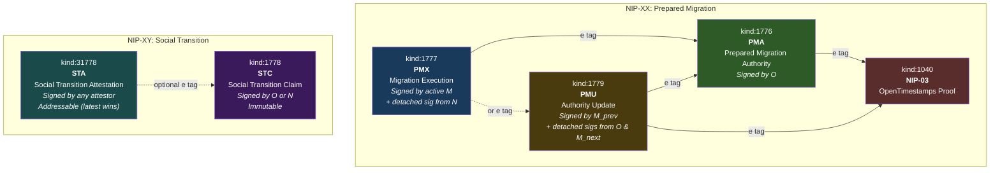

---

## 13. Decision Tree: What Should a Client Do?

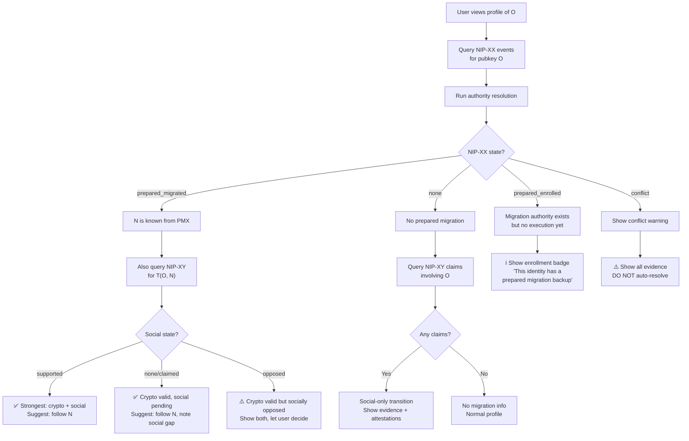
